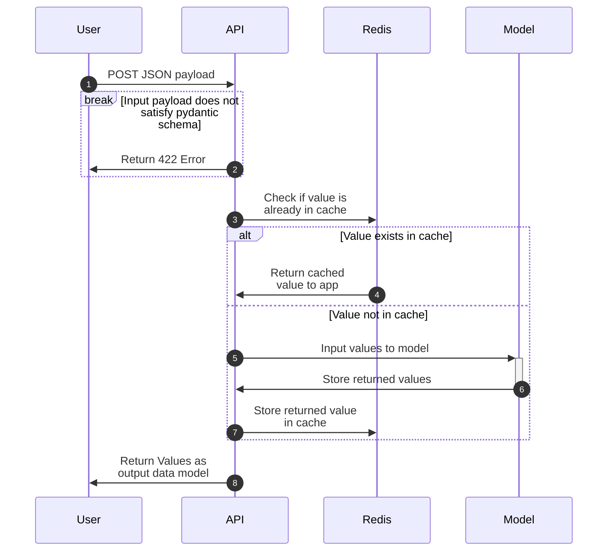
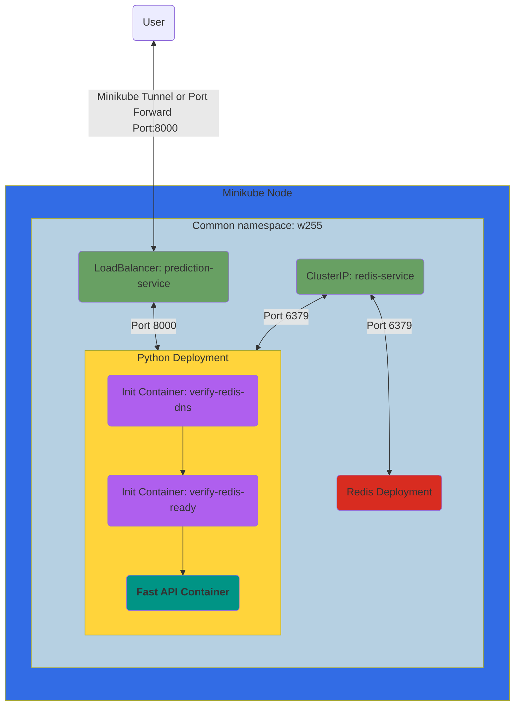

# Lab 3: Caching and Kubernetes

<p align="center">
    <!--FAST API-->
        
    <!--PLUS SIGN-->
        
    <!--REDIS LOGO-->
        
    <!--PLUS SIGN-->
        
    <!--KUBERNETES-->
        
</p>

- [Lab 3: Caching and Kubernetes](#lab-3-caching-and-kubernetes)
  - [Lab Overview](#lab-overview)
  - [Lab Objectives](#lab-objectives)
    - [API Requirements](#api-requirements)
    - [Deployment Requirements](#deployment-requirements)
    - [Documentation Requirements](#documentation-requirements)
    - [API Diagram](#api-diagram)
    - [Deployment Diagram](#deployment-diagram)
    - [Lab Setup](#lab-setup)
    - [Expected Final Folder Structure](#expected-final-folder-structure)
    - [Run Script](#run-script)
  - [Submission](#submission)
  - [Grading](#grading)
  - [Time Expectations](#time-expectations)
  - [Helpful Tips](#helpful-tips)
    - [How to approach this lab](#how-to-approach-this-lab)
      - [Redis in Development](#redis-in-development)
    - [Redis Caching](#redis-caching)
    - [Input Vectorization](#input-vectorization)
    - [Kubectl and minikube](#kubectl-and-minikube)
    - [Networking Requirements](#networking-requirements)
    - [Docker Daemons](#docker-daemons)
    - [Specialized Containers: Init + Readiness + Liveness](#specialized-containers-init--readiness--liveness)
      - [Init Containers](#init-containers)
      - [Readiness Probe](#readiness-probe)
      - [Liveness Probe](#liveness-probe)
    - [Redis Deployment](#redis-deployment)

## Lab Overview

The goal of `lab_3` is to extend your `FastAPI` application from `lab_2` with the following:

- Your API takes a *list* of inputs to predict instead of a single input.
- Your API will have a rudimentary Redis cache for the `/predict` endpoint based on the inputs.
- Your application deploys locally on a Kubernetes environment (minikube).

## Lab Objectives

### API Requirements

- [x] All requirements from `lab_2`
- [ ] Ensure `/predict` endpoint uses a `POST` method
- [ ] Ensure model is loaded only when the container is instantiated/started (i.e. not everytime you run a predict)
- [ ] Create additional `pydantic` models which wrap the input and output models from `lab_2` to accept a list of inputs and return a list of outputs
  - Your wrapper pydantic model should use the key `houses` as the field name
- [ ] Ensure `/predict` takes a `List` of inputs based on a `pydantic` model instead of only a single record
- [ ] Cache entire input `List` sent to `/predict` to Redis (See [Redis Caching](#redis-caching))
- [ ] Run your predictions on a matrix input instead of row by row. (See [Input Vectorization](#input-vectorization))
- [ ] Update your tests from `lab_2` to give list inputs

### Deployment Requirements

- [ ] Deploy your application to Kubernetes locally (minikube)
  - [ ] Deploy all components to a non-default `namespace` called `w255`
  - [ ] Deployment for Redis in `w255` namespace
  - [ ] Deployment for your API in `w255` namespace
  - [ ] Service for Redis in `w255` namespace
  - [ ] Service for API in `w255` namespace
- [ ] Include an `initContainer`, `readinessProbe`, and `livenessProbe` for your API deployment
  - [ ] `initContainer` should wait for the Redis Service to become available
  - [ ] `readinessProbe` should wait for the API to be locally available by using the `/health` endpoint
  - [ ] `livenessProbe` should monitor whether the API is responsive by using the `/health` endpoint

See: [Expected Final Folder Structure](#expected-final-folder-structure) for more guidance on how to organize your deployment files.

### Documentation Requirements

- [ ] Design a bash script `run.sh` which demonstrates your application working as a kubernetes application as described by [Run Script](#run-script)
- [ ] Create a `README.md` for how to build, run, and test code
- [ ] Answer the following questions:
  1. What are the benefits of caching?
  1. What is the difference between Docker and Kubernetes?
  1. What does a kubernetes `deployment` do?
  1. What does a kubernetes `service` do?

### API Diagram

The following is a visualization of the sequence diagram describing our new API



### Deployment Diagram

The following is a visualization of the infrastructure you should implement for Lab 3.



### Lab Setup

Copy your code from lab 2 into a new lab folder `lab_3`. You will use the same model you trained in `lab_3`

Install `minikube` ([Docs](https://minikube.sigs.k8s.io/docs/start/))

Change Kubernetes version to match what we will deploy into Azure Kubernetes Service (AKS) for future labs and projects, `1.25.4`.

`minikube start --kubernetes-version=v1.25.4`

### Expected Final Folder Structure

```text
.
└── .gitignore
├── lab_1
├── lab_2
├── lab_3
|   ├── lab3
|   |   ├── infra
|   |   |   ├── deployment-pythonapi.yaml
|   |   |   ├── deployment-redis.yaml
|   |   |   ├── namespace.yaml
|   |   |   ├── service-prediction.yaml
|   |   |   └── service-redis.yaml
|   │   ├── Dockerfile
|   │   ├── README.md
|   │   ├── lab3
|   │   │   ├── __init__.py
|   │   │   └── main.py
|   │   ├── model_pipeline.pkl
|   │   ├── poetry.lock
|   │   ├── pyproject.toml
|   │   ├── tests
|   │   │   ├── __init__.py
|   │   │   └── test_lab3.py
|   │   └── trainer
|   │       └── trainer.py
|   └── run.sh
├── lab_4
├── lab_5
└── project
```

### Run Script

Most of your work for this lab will be in coordinating your kubernetes deployment and run script. The high level overview of your runscript should do the following:

1. Start up minikube
1. Setup your docker daemon to build with minikube
1. Ensure your API model is trained, run the trainscript if needed
1. Build the docker container of your application
1. Apply your k8s namespace
1. Apply your Deployments and Services
1. (if you choose to use `minikube tunnel` ) Create a separate `minikube tunnel` process and record the PID of that process **OR** `port-forward` a local port on your machine to your API service
1. Wait for your API to be accessible
   - This is a separate check from your init containers and other health checks.
   - This should run to make sure your API is accessible/ready from your run script
1. Validate all Lab 1 Endpoints
1. Validate all Lab 2/3 Endpoints
1. Clean up after yourself
   - (if you used `minikube tunnel`) kill the `minikube tunnel` process you ran earlier
   - delete all resources in the `w255` namespace
   - delete the `w255` namespace
   - stop minikube

*Note:* It is expected that your YAMLs will use the right namespace *and* your kubectl commands will also define the `--namespace`

## Submission

All code will be graded off your repo's `main` branch. No additional forms or submission processes are needed.

## Grading

Grades will be given based on the following:

|       **Criteria**       |          **0%**           |                           **50%**                            |                              **90%**                               |                              **100%**                              |
| :----------------------: | :-----------------------: | :----------------------------------------------------------: | :----------------------------------------------------------------: | :----------------------------------------------------------------: |
|     *Functional API*     |     No Endpoints Work     |                  Some Endpoints Functional                   |                     Most Endpoints Functional                      |                          All Criteria Met                          |
|        *Caching*         |   No Attempt at Caching   |           Caching system instantiated but not used           |       Caching system created but missing some functionality        |                          All Criteria Met                          |
|  *Kubernetes Practices*  | No Attempt at Deployments |         Deployments exist but lack key functionality         |              Kubernetes deployment mostly functional               |                          All Criteria Met                          |
|        *Testing*         |    No Testing is done     | Minimal amount of testing done. No testing of new endpoints. |          Only "happy path" tested and with minimal cases           |                          All Criteria Met                          |
|       *Run Script*       |   No Run Script exists    |   Run Script is not functional or missing key requirements   |                Run Script missing some requirements                |                          All Criteria Met                          |
|     *Documentation*      |  No Documentation exists  |                   Very weak documentation                    |                Documentation missing some elements                 |                          All Criteria Met                          |
| *Short-Answer Questions* |  No Questions Attempted   |                 Minimal or incorrect answers                 | Mostly well thought through answers but may be missing some points | Clear and succinct answers that demonstrate understanding of topic |

## Time Expectations

This lab will take approximately ~20 hours. Most of the time will be spent configuring Kubernetes, the deployment, and services, followed by testing to ensure everything is working correctly. Minimal changes to the API are required.

---

## Helpful Tips

### How to approach this lab

We have done our best to organize this lab in a top-down fashion to best direct your order of operations. Focus on doing all the [API Requirements](#api-requirements) first, then work on [Deployment Requirements](#deployment-requirements).

#### Redis in Development

When working on the [API Requirements](#api-requirements), you will need to have some form of Redis available so that you can verify caching. You can do this by running Redis via docker-compose with the following script.

NOTE: **DOCKER COMPOSE IS A STOP GAP TO HELP DEVELOPMENT AND IS NOT ACCEPTABLE TO BE USED IN-PLACE OF KUBERNETES. YOUR SOLUTION WILL NOT BE ACCEPTED IF IT REQUIRES THE USE OF DOCKER COMPOSE INSTEAD OF KUBERNETES. DO NOT USE COMPOSE IN YOUR RUN SCRIPT**

```yaml
version: '3.9'
services:
  redis:
    image: redis:alpine
    ports:
      - '6379:6379'
```

To standup redis, you can call `docker compose up -d`. This will allow redis to be available on localhost port `6379`. Once you verify that your code works with a redis cache deployed on that port, bring down the instance by calling `docker compose down` and move on to creating services and deployments in kubernetes.

### Redis Caching

In this lab we will utilize a naive approach to caching to protect you from repeated messages. You should use [`fastapi-cache2`](https://github.com/long2ice/fastapi-cache) library that handles a lot of things for you. Add this as a dependancy to your poetry build. Make sure to review how to install it properly as well as utilize it in your code.

### Input Vectorization

Don't use a `for` loop to iterate through all of your prediction inputs and feed the model one-by-one. Doing this will incur a lot of overhead as your model will have to constantly be brought up and then torn down after doing a single input. Instead, you can feed the model multiple inputs at the same time and it will return multiple outputs. This is called input vectorization and will improve performance dramatically when large batches are sent

### Kubectl and minikube

The following are a nonexhaustive list of commands which you may find useful for utilizing kubectl and minikube

```bash
kubectl version --client
kubectl apply -f <configuration file (.yaml) for deployments | services | namespaces | configMap>
kubectl delete <name of deployment | services | namespace>
kubectl delete --all <deployment | service>
kubectl get all
kubectl get deployments
kubectl get services
kubectl get configmap
kubectl get secrets
kubectl get namespaces
kubectl logs <deployment instance. Example: lab3-deployment-8686ccf5c8-f6j5m>
kubectl <command> --help
kubectl port-forward <deployment instance> <local port>:<remote port>
```

Each of these commands can be followed by `--namespace=w255` if you would like to use it for w255 namespace, unless you have executed the following command:

```bash
 kubectl config set-context --current --namespace=w255
```

YAML files which you use for deployment should define the specific namespace (i.e. don't leave your YAMLs without the `namespace` argument).

Minikube

```bash
minikube status
minikube start
minikube stop
minikube delete
minikube kubectl version
minikube service list
minikube ip
```

### Networking Requirements

To access your deployments, you will need to utilize one of two systems:

1. Utilize `minikube tunnel` to facilitate networking. You will likely need to run this as a separate subprocess while developing. If you use this method in your run script you will need to kill this process after you are done with it.
1. Utilize `kubectl port-forward ...` to bridge your local network to your API

Either is acceptable as long as you can make it work consistently.

### Docker Daemons

You should setup your docker daemon to communicate with minikube so that all build images are accessible from minikube
`eval $(minikube docker-env)`

Review the [synopsis described here in the docs](https://minikube.sigs.k8s.io/docs/commands/docker-env/#synopsis) about what this command does.

### Specialized Containers: Init + Readiness + Liveness

Part of your API deployment requires the use of Init Contianers, Rediness Probes, and Liveness probes.

#### Init Containers

You should use `busybox` as the base `image`. `busybox` gives you a basic shell to run commands.

You will want one init container that waits for the redis `service` managed by kubernetes to be up by asking if the network DNS for that service is available.

After that first init container, you will want a second conrtainer which `PING`s the redis deployment through that newly available service to see if the `redis` deployment/application is ready to accept new values in the store. Redis will respond to the `PING` message with a `PONG`. You can ping the container with clever use of netcat (with the command `nc`). Do not use untrusted base images from dockerhub to accomplish this network check.

#### Readiness Probe

Similar to the `HEALTHCHECK` directive that we had in docker, Kubernetes has a directive to check if the API deployment/pod is ready after startup. Create a `readiness` probe that checks if your `/health` endpoint responds to a `GET` request.

The `HEALTHCHECK` directive we had in docker ***will not work*** in kubernetes as it is explicitly not supported. You should delete it from your dockerfile so you don't have any confusion.

#### Liveness Probe

Whereas a `Readiness` probe checks on initial startup, a liveness probe checks to see if the specific pod is still alive/responding. This should similarly check if the `/health` endpoint to verify if the API is still working (as opposed to stuck in an infinite loop or unresponsive)

### Redis Deployment

You should use the official `redis` image from dockerhub. You don't need to worry about having incredibly complex deployment setups and a very minimal configuration just to get it running is fine. In a more production environment, we would make this deployment a `StatefulSet`; this requires a lot more configuration which we won't worry about for this class.
